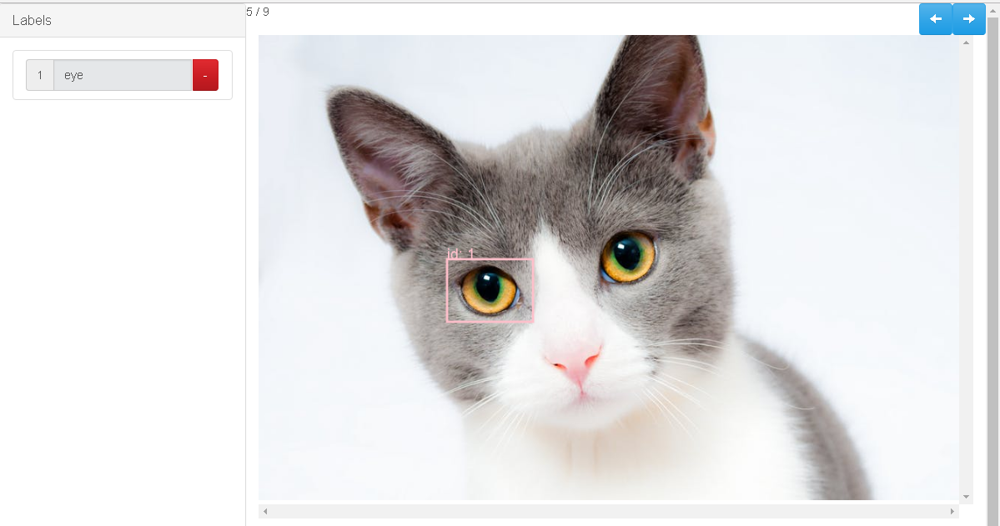

# Simple Image Annotator

## Description
I modified a great simple image annotator developed by Sebastian Perez (sgp715) to facilitate browsing forward and backward and to output data in per-image files in KITTI format for easy consumption for object detection using detectnet.


## Install
* Install Flask
```
$ pip install Flask
```

## Getting started
* cd into this directory after cloning the repo
* start the app
```
$ python app.py /images/directory
```
* you can also specify the directory you would like the annotations output to (image dir is the default)
```
$ python app.py /images/directory --out /labels
```
* specify port if you want (5555 is default)
```
$ python app.py /images/directory --out /labels --port 5556
```
* open http://127.0.0.1:5555/tagger in your browser
    * only tested on Chrome

## Output
* This branch outputs data in KITTI format for easy consumption in DIGITS using detectnet
  * filename is the same as the input image file prefix changed to .txt
  * pertinent columns for detectnet are 0: label; 1: truncated; 4: xmin; 5: ymin; 6: xmax; 7: ymax
```
person 0.2 0 0.0 114.0 650.0 227.0 796.0 0.0 0.0 0.0 0.0 0.0 0.0 0.0
```

## HOWTOs
* draw a bounding box
  * click on the image in the location of the first corner of the bounding box you would like to add
  * click again for the second corner and the box will be drawn
* add a label for a box
  * for the box you would like to give a label, find its id (noted in the top left corner of the box)
  * find the label with the corresponding number
  * enter the name you want in the input field
  * press enter
* move to next image
  * click the blue right arrow button at the top of the page (depending on the size of the image you may have to scroll down)
* move to the previous image
  * click the left arrow button at the top of the page
* remove label
  click the red button on the label you would like to remove
* check generated data
  * the output directory should contain one .txt file per image with KITTI format data
